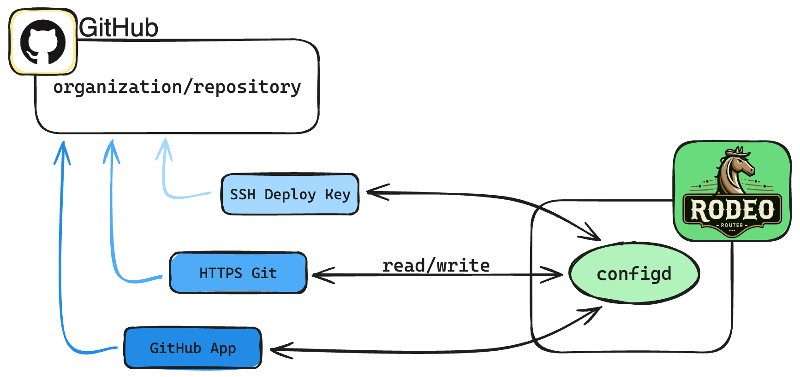

# Cloud Synchronization of Config Files

**Status**: Proposed

## Context

To create immutable infrastructure, we want to ensure that all configuration files can be synchronized to a controlled location. This will allow us to ensure that all configuration files are versioned, can be rolled back, and can be re-deployed in the event of a failure.

## Decision

We will implement a config synchronization service (`configd`) that will allow systems to synchronize their configuration with a Git repository. This service will be responsible for pulling the latest configuration from the repository and applying it to the system. It will also be responsible for pushing changes back to the repository. This service will be implemented as a first-party component of the Rodeo Router project.

In order to ensure that the configuration files are not tampered with, we will implement SHA256 checksum validation on the configuration files. The checksums will be stored in the Git repository and will be validated by the `configd` service before applying the configuration.

On each system boot, the `configd` service will check the remote checksums against the local checksums. If the checksums do not match, the `configd` service will pull the latest configuration from the repository and apply it to the system.

Should a user wish to manually update the configuration files, they will be able to do so by editing the files directly on the system with a CLI argument (`--unsynced`). This will allow the user to make changes to the configuration files without the `configd` service overwriting them. This will be valuable for debugging, testing, and development purposes.

Authentication to a Git repository would be handled one of three ways:

1. Over SSH with an SSH key
2. Over HTTPS with a username and password
3. GitHub App based authentication

This would allow for a variety of authentication methods to be used, depending on the user's preference and the security requirements of the organization. The authentication method would be configurable in the `configd` service configuration file, and credentials would be stored in the `trustd` service, with the `configd` service having read-only access to the credentials at the time of synchronization.

## Consequences

The benefits of this approach are that all configuration files will be versioned, can be quickly and easily rolled back, and can be re-deployed in the event of system failure. This will allow for a more secure and reliable system, as well as easier debugging and testing of configuration changes.

The risks of this approach are that the configuration files could be tampered with if the Git repository is compromised. To mitigate this risk, SHA256 checksum validation will be implemented to ensure that the configuration files have not been tampered with.

Additionally, the `configd` service would be the only service with access to the keys/credentials stored in the `trustd` service. This would force a bad actor to need to compromise the `configd` service itself in order to gain access to the credentials rather than exfiltrating credentials through another service.
